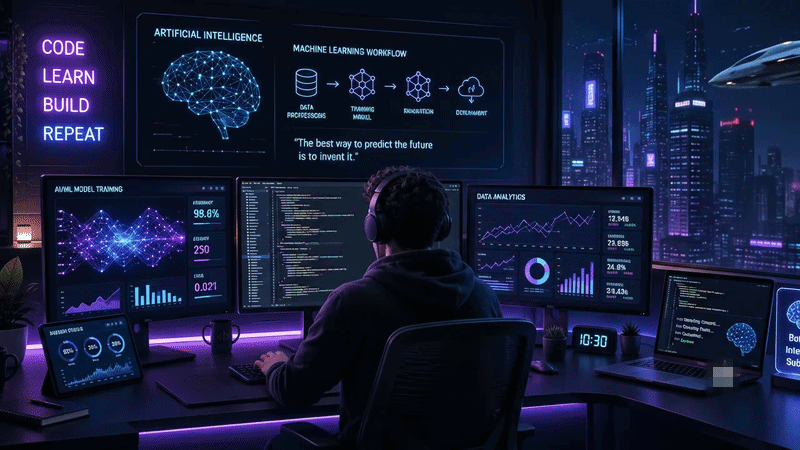
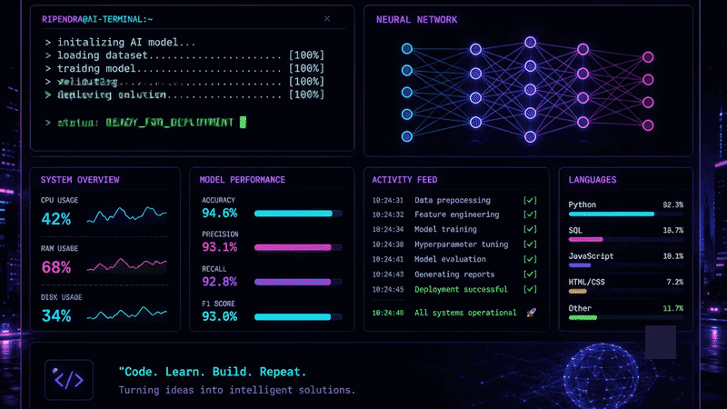

<div align="center">

<!-- ══════════════════ REALISTIC CODING BANNER ══════════════════ -->


# Hi 👋, I'm Ripendra Kumar Yadav

### 🤖 AI/ML Engineer &nbsp;|&nbsp; 📊 Data Analyst &nbsp;|&nbsp; 🛠️ Builder

<a href="https://git.io/typing-svg">
  
</a>

<br/><br/>

-6D28D9?style=for-the-badge&logo=googlescholar&logoColor=white)


<br/>

[](https://github.com/Ripendra6218)
[](https://www.linkedin.com/in/ripendra-yadav-675829261)
[](mailto:rky230104@gmail.com)
[](https://github.com/Ripendra6218)

<br/>


</div>

<br/>

---

## 🧠 About Me


```yaml
name: "Ripendra Kumar Yadav"
title: "AI/ML Engineer | Data Analyst"
degree: "B.Tech, CSE (AI & ML)"
institute: "Technocrats Institute of Technology"
location: "Sonbhadra, Uttar Pradesh, India"
focus: ["Machine Learning", "Computer Vision",
        "Data Analytics", "Model Deployment"]
philosophy: "Building data-driven, real-world AI
             systems — not just notebooks."
```

- 🔭 Final-year AI/ML student who enjoys the **full lifecycle of a model** — from messy raw data to a deployed, usable application
- 🧪 Hands-on internship experience at **Infosys Springboard** and **IBM SkillsBuild**
- 📈 My work spans **EDA & dashboarding**, **predictive modeling**, and **real-time computer vision**
- 🎯 I care about **outcomes over algorithms** — models that improve a real metric, dashboards that answer a real business question
- 💼 **Open to:** Data Analyst roles · AI/ML Engineer roles · ML Internships · Open-source ML/CV collabs

<br clear="right"/>

---

## 🛠️ Tech Stack

<div align="center">

**👨‍💻 Languages**


**🤖 Data, ML & Computer Vision**


**🗄️ Databases & Visualization**


**⚙️ Tools & Cloud**


</div>

---

## 🤖 AI / ML Expertise

<div align="center">

| Domain | Proficiency | Details |
|---|:---:|---|
| **Data Analysis & EDA** | ⭐⭐⭐⭐⭐ | Descriptive statistics, data cleaning, SQL-driven KPI extraction |
| **Predictive Modeling** | ⭐⭐⭐⭐☆ | Regression & classification, feature engineering, hyperparameter tuning |
| **Computer Vision** | ⭐⭐⭐⭐☆ | Real-time detection pipelines, CNN-based models, latency optimization |
| **Model Evaluation** | ⭐⭐⭐⭐☆ | ROC-AUC analysis, threshold tuning, GridSearchCV, overfitting control |
| **Dashboarding & BI** | ⭐⭐⭐⭐☆ | Power BI / Tableau dashboards for business insight generation |
| **Deployment** | ⭐⭐⭐☆☆ | Streamlit apps for real-time end-user model access |

</div>

---

## 🚀 Featured Projects

<details>
<summary><b>🦯 VisionMate — Real-Time AI Assistive Mobility System</b> &nbsp;<code>88% accuracy · −22% latency</code></summary>
<br/>

Real-time computer vision system built during the **Infosys Springboard Internship**, designed to help visually impaired users navigate safely through live object detection, distance estimation, and voice alerts.

| Category | Details |
|---|---|
| **Stack** | Python, OpenCV, TensorFlow, CNN |
| **Scale** | Real-time video inference pipeline |
| **Performance** | 88% detection accuracy · 22% reduction in inference latency |
| **Privacy** | Local inference — no external data transmission |
| **Impact** | Real-time obstacle detection with voice-alert accessibility |
| **Repository** | [github.com/Ripendra6218](https://github.com/Ripendra6218) |

Dataset preprocessing, cleaning, and feature extraction fed into a CNN-based object detection model. Performance metrics were continuously analyzed to identify bottlenecks, guiding iterative optimization of both accuracy and real-time responsiveness.

</details>

<details>
<summary><b>💰 Employee Salary Prediction — End-to-End ML Deployment</b> &nbsp;<code>R² 0.89 · Streamlit</code></summary>
<br/>

Regression-based salary prediction system built during the **IBM SkillsBuild AI Internship**, deployed as an interactive web application for real-time end-user access.

| Category | Details |
|---|---|
| **Stack** | Python, Pandas, Scikit-Learn, Random Forest, Streamlit |
| **Scale** | Full EDA-to-deployment pipeline |
| **Performance** | R² score of 0.89 · 11% improvement via feature engineering & tuning |
| **Impact** | Real-time salary estimation for end users |
| **Repository** | [github.com/Ripendra6218](https://github.com/Ripendra6218) |

EDA and feature engineering surfaced key salary-driving attributes. Model validation and hyperparameter tuning reduced overfitting, and the final model was deployed via Streamlit for interactive, real-time predictions.

</details>

<details>
<summary><b>📉 Customer Churn Prediction System</b> &nbsp;<code>90% accuracy · −15% false positives</code></summary>
<br/>

Classification system to predict customer churn, with an emphasis on minimizing false positives through careful threshold tuning.

| Category | Details |
|---|---|
| **Stack** | Python, Scikit-Learn, GridSearchCV |
| **Scale** | Full classification pipeline with cross-validation |
| **Performance** | 90% accuracy · 15% reduction in false positives |
| **Impact** | More reliable churn flags for targeted retention strategy |
| **Repository** | [github.com/Ripendra6218](https://github.com/Ripendra6218) |

Built a classification model optimized using ROC-AUC analysis and threshold tuning. Cross-validation and GridSearchCV were used to systematically optimize model performance and generalization.

</details>

<details>
<summary><b>🛒 Retail Sales Data Analysis & Business Dashboard</b> &nbsp;<code>10,000+ transactions</code></summary>
<br/>

End-to-end analysis of 10,000+ retail transactions, translating raw transactional data into actionable business KPIs and interactive dashboards.

| Category | Details |
|---|---|
| **Stack** | Python, SQL, Matplotlib, Seaborn, Power BI |
| **Scale** | 10,000+ transactions analyzed |
| **Highlights** | KPI extraction via JOIN & GROUP BY queries |
| **Impact** | Data-driven recommendations for inventory planning & pricing |
| **Repository** | [github.com/Ripendra6218](https://github.com/Ripendra6218) |

SQL and Python were used to extract KPIs such as total revenue, average order value, and category performance. Visual reports and interactive dashboards surfaced monthly growth trends and informed pricing and inventory decisions.

</details>

---

## 💼 Experience

### 🔹 AI Intern — Real-Time Computer Vision
**Infosys Springboard** · `Nov 2025 – Jan 2026`

> Worked on **VisionMate**, a real-time assistive mobility system for visually impaired users.

- 🧹 Performed dataset preprocessing, cleaning, and feature extraction for a real-time CV system
- 🎯 Achieved **88% detection accuracy** and reduced inference latency by **22%**
- 🔍 Analyzed model performance metrics to identify bottlenecks and guide iterative improvements
- 📐 Applied statistical, data-driven optimization to enhance real-time system reliability

`Python` `OpenCV` `TensorFlow` `Computer Vision` `Model Optimization`

<br/>

### 🔹 AI Intern — Predictive Modeling
**IBM SkillsBuild** · `Jun 2025 – Jul 2025`

> Built and deployed a salary prediction system — from exploratory analysis to a live Streamlit app.

- 📊 Conducted EDA and feature engineering to identify salary trends and key predictive attributes
- 🎯 Built regression models achieving **R² 0.89**, improving predictive performance by **11%**
- 🛡️ Performed model validation and hyperparameter tuning to reduce overfitting
- 🚀 Deployed an interactive salary prediction application using **Streamlit**

`Python` `Scikit-Learn` `Regression` `Streamlit` `Feature Engineering`

---

## 🏆 Achievements

<div align="center">

| 🏅 Recognition | Details |
|---|---|
| **Infosys Springboard AI/ML Internship** | Selected contributor — VisionMate assistive mobility system |
| **IBM SkillsBuild AI Internship** | Completed end-to-end ML deployment project |
| **Academic Standing** | CGPA 7.81 in B.Tech (AI & ML), Technocrats Institute of Technology |

</div>

---

## 📜 Certifications

<div align="center">


</div>

---

## 💻 Coding Profiles

<div align="center">

<!-- TODO: Replace the URLs below with your actual profile handles -->
[](https://leetcode.com/)
[](https://www.geeksforgeeks.org/)
[](https://www.hackerrank.com/)
[](https://www.codechef.com/)

</div>

---

## 🕹️Terminal Dashboard

<div align="center">

<p align="center">

</p>

<br>

<p align="center">
  
</p>

</div>

## 📊 GitHub Stats

<div align="center">


<br>


<br>


</div>

## 🐍 Contribution Snake

<div align="center">

<picture>
  <source media="(prefers-color-scheme: dark)"
          srcset="https://raw.githubusercontent.com/Ripendra6218/Ripendra6218/output/github-contribution-grid-snake-dark.svg">
  <source media="(prefers-color-scheme: light)"
          srcset="https://raw.githubusercontent.com/Ripendra6218/Ripendra6218/output/github-contribution-grid-snake.svg">
  
</picture>

</div>

## 📊 Recent GitHub Activity

<!--START_SECTION:activity-->
<!--END_SECTION:activity-->

<!-- This section auto-updates via .github/workflows/update-readme.yml -->

---

## 🎯 Current Focus

```yaml
learning:
  - "Advanced Deep Learning & CNN architectures"
  - "Cloud deployment for ML pipelines"
  - "SQL query optimization for large datasets"

building:
  - "VisionMate: expanding real-time assistive CV features"
  - "End-to-end analytics dashboards with Power BI"

exploring:
  - "MLOps fundamentals"
  - "Generative AI applications"

open_to:
  - "Data Analyst roles"
  - "AI/ML Engineer roles"
  - "Internships & collaborative ML/CV projects"
```

---

## 📬 Connect With Me

<div align="center">

[](mailto:rky230104@gmail.com)
[](https://www.linkedin.com/in/ripendra-yadav-675829261)
[](https://github.com/Ripendra6218)

</div>

---

<div align="center">

### 💬 *"Data tells the story — models just help you read it faster."*


</div>
